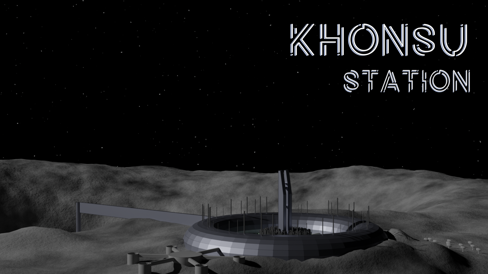

# Dossier de référence de Khonsu Station

## Sections

* [Game Design Doc](game_design.md): Document résumant le principe du jeu et les grandes lignes des concepts
* [Khonsu Station](khonsu_station.md): Description et historique de la station
* [Narration](narration.md): Narration détaillée du jeu
* [Ennemis](ennemis.md): Monstres et ennemis
* [Niveaux](niveaux.md): Niveaux du jeu
* [Interface](interface.md): Interface et UI du jeu
* [References](refs.md): Liste de références utilisées dans le design du jeu
