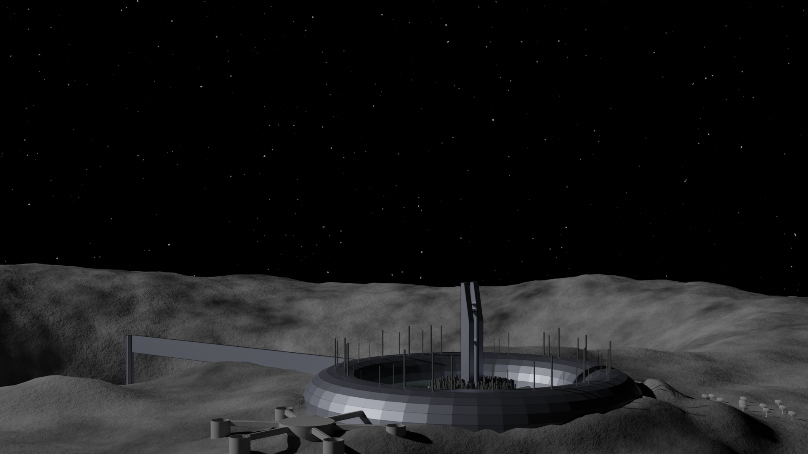

# Khonsu Station: Description et plans

## Historique

### 1. 2072 - Fondation 
Fondée en 2072 Khonsu Station est la troisième station de recherche lunaire après les stations Chang’e près du pôle Sud (2067) et Selene **[trouver une position pertinente]** (2070). Originellement une station de recherche pluridisciplinaire, elle regroupait deux ans après sa création des chercheur.euse.s en biologie pour l’étude des effets de la vie sur la lune sur les humains, en chimie sur les matériaux lunaires, en physique sur l’étude des radiations et en géologie sur l’étude de la structure interne de la Lune. A son pic, la station regroupe un staff de 80 chercheur.euse.s à plein temps et 50 personnes permettant le support : cuisines, importations de la Terre, logistique intra-base et gestion informatique/électronique. Une partie des activités de gestion sont effectuées à distance depuis la Terre.

De 2072 à 2080, trois autres stations de recherche sont mises en place sur la Lune **[trouver noms et localisations]**. En 2080, après huit années d’exploitation, Khonsu suit l’exemple de Selene et devient un territoire indépendant. En ouvrant ses “frontières” et en permettant l’exploitation minière robotisée des gisements proches, Khonsu assure son indépendance et permet des échanges sereins avec les nations de la Terre et les autres stations lunaires. Contrairement à d’autres stations, Khonsu évolue alors en une communauté autogérée, accueillant environ 400 habitants à l’année et quelques 80 saisonniers.

### 2. 2080 - Communauté autogérée et croissance de la station

Afin d'avoir une production de produits de base suffisante pour assurer la survie et la pérénnité des habitants et habitantes, l'administration de la station se lance dans un gigantesque chantier afin de construire un anneau d'habitations. L'objectif de la station est de croître de manière régulière. Un plan à 10 ans est créé afin de construire la nouvelle station centrée sur l'ancienne. Elle est constituée d'un anneau d'habitations divisé en huit quadrants et centré autour des centres d'activité principaux de la station. L'anneau d'habitation est construit secteur par secteur progressivement. Pour chaque secteur, on installe des fermes hydroponiques entre le secteur d'habitation et le centre de la station afin d'assurer une croissance de la production de nourriture proportionnelle avec la quantité d'habitations.

## Plan de la station

## Sections